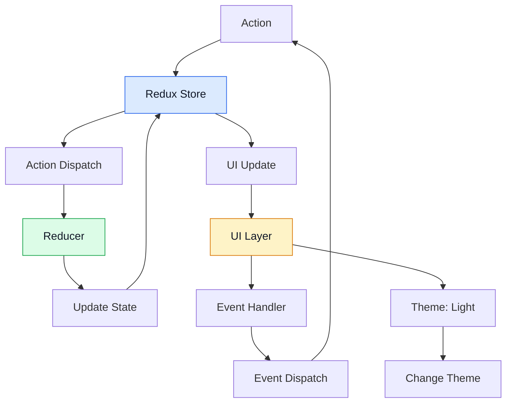

# What issues Redux toolkit solved
1. Data Centralization
2. State management
3. Avoid Prop Drilling

# Architecture

```mermaid
flowchart TD
    A[Action] --> B[Redux Store]

    B --> C[Action Dispatch]
    C --> D[Reducer]
    D --> E[Update State]
    E --> B

    B --> F[UI Update]
    F --> G[UI Layer]

    G --> H[Event Handler]
    H --> I[Event Dispatch]
    I --> A

    G --> J[Theme: Light]
    J --> K[Change Theme]

    style B fill:#dbeafe,stroke:#2563eb,color:#111827
    style D fill:#dcfce7,stroke:#16a34a,color:#111827
    style G fill:#fef3c7,stroke:#d97706,color:#111827
```